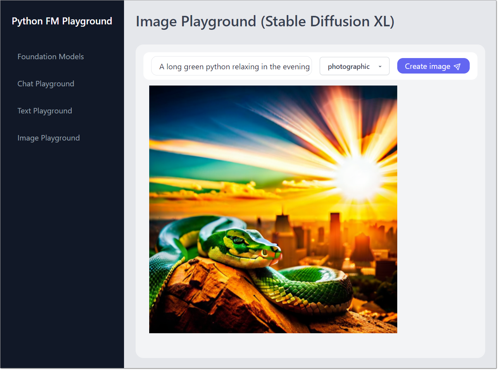

# 🐍 Python FM Playground

Welcome to the Python Foundation Model (FM) Playground, an example app to explore how to use **Amazon Bedrock** with boto3, the AWS SDK for Python.

> 🚨 **Important:** This application is for educational purposes and not intended for production use.

## Overview

This repository includes a **FastAPI** application and a **Next.js** frontend, both executable locally. Below is a screenshot of the app in action.



## ⚠ Important

- Running this application might result in charges to your AWS account. For more details, see [Amazon Bedrock Pricing](https://aws.amazon.com/bedrock/pricing/).
- This app is configured to run in `us-east-1` and has not been tested in every AWS Region. For more information see [AWS Regional Services](https://aws.amazon.com/about-aws/global-infrastructure/regional-product-services).
- We recommend that you grant your code least privilege, i.e. only the minimum permissions required by the application. You can find an IAM Policy document with the required permissions in this repository at `resources/bedrock-access-policy.json`:

## Prerequisites

Ensure you have the following installed:

- [Python 3.8+](https://www.python.org/downloads/) with pip for the backend server.
- [Node.js (v18.17+)](https://docs.npmjs.com/downloading-and-installing-node-js-and-npm) with npm for the frontend application
- You must have an [AWS account](https://aws.amazon.com/free/), and have your default credentials and AWS Region configured as described in the [AWS Tools and SDKs Shared Configuration and Credentials Reference Guide](https://docs.aws.amazon.com/credref/latest/refdocs/creds-config-files.html).
- You must request access to the models before you can use them. For more information, see [Model access](https://docs.aws.amazon.com/bedrock/latest/userguide/model-access.html). To run the app, you need access to the following models in `us-east-1`:
  - Anthropic: Claude
  - AI21 Labs: Jurassic-2 Mid
  - Stability AI: Stable Diffusion XL

## Running the Application

After verifying the prerequisites, follow these steps:

### Clone the repository

Open a terminal, navigate to a directory of your choice, and execute the following command:

```shell
git clone https://github.com/build-on-aws/python-fm-playground.git
```

### Virtual Environment Setup

It's recommended to use a virtual environment for your Python projects to manage dependencies separately for each project. If you're not already in a virtual environment, navigate to the project directory to create and activate the virtual environment:

```shell
# Windows:
cd python-fm-playground
python -m venv .venv
.venv\Scripts\activate   
```

```shell
# Linux/MacOS
cd python-fm-playground
python -m venv .venv
source .venv/bin/activate  
```

### Backend Setup

In the `backend` directory, install the packages required by running the following in the virtual environment:

```shell
pip install -r requirements.txt
```

After successful installation you can start the backend server by executing the following command:

```shell
python main.py
```

> **Note:** The backend runs on port 55500 by default. See below for port changes.

### Frontend Setup

In a new terminal window, navigate to the directory `frontend` and install the packages required by running the following command:

```shell
npm install
```

After successful installation you can start the frontend application by executing the following command:

```shell
npm run dev
```

> **Note:** The frontend runs on port 3000 by default. See below for port changes.

## Accessing the Application

Open `http://localhost:3000` in your web browser to interact with the application.

## Stopping the Application

To halt the application, you will need to stop both the backend and frontend processes.

### Stopping the Frontend

In the terminal where the frontend is running, press `Ctrl + C` to terminate the process.

### Stopping the Backend

Similarly, in the backend terminal, use the `Ctrl + C` shortcut to stop the server.

### Deactivating the Virtual Environment

To deactivate the virtual environment, you can simply close the backend terminal, or execute the following command:

```shell
# Windows:
.venv\Scripts\deactivate.bat
```

```shell
# Linux/MacOS
deactivate
```

If you encounter any issues, you can forcefully terminate the processes by finding the process ID (`PID`) and using the `kill` command on Unix-based systems or Task Manager on Windows.


## Using Different Ports

Change the backend port in the following files:
- `backend/config.py`
- `frontend/app/app.config.js`

To run the frontend on a different port:

```shell
npm run dev -- --port NEW_PORT
```

## Troubleshooting

The AWS Region is hard-coded in the application. However, if your local `AWS_REGION` environment variable is set to a different region, the application may fail. In this case, please make sure to either unset `AWS_REGION`, or set it to `us-east-1`.

## License

This library is licensed under the MIT-0 License. See the [LICENSE](LICENSE) file.

## Security

See [CONTRIBUTING](CONTRIBUTING.md#security-issue-notifications) for more information.
